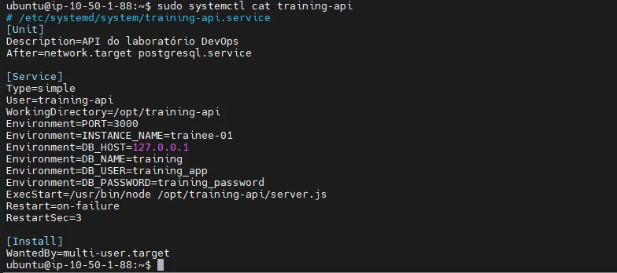

# Laboratório de Troubleshooting — DevOps
 
## Objetivo

Foi apresentado um ambiente Linux que executa uma aplicação web simples. A aplicação possui três camadas:

- Uma interface Web;
- Uma API responsável pela lógica de aplicação;
- Um banco de dados que armazena os dados exibidos.

O ambiente foi preparado com uma falha controlada. A missão era investigar o estado da aplicação, identificar a causa raiz e reativar o fluxo completo para que a página volte a funcionar.

## Resultado esperado

Ao concluir o laboratório: 

- A aplicação estará acessível pelo endereço recebido;
- A interface conseguirá consultar e exibir os dados do banco;  
- Os serviços necessários estarão funcionando;
- Você conseguirá explicar em qual camada estava o problema e por que a correção resolveu o incidente. 

## Ambiente 

| Item | Detalhe |
|---|---|
| Instância | AWS EC2 (`trainee-01`) |
| Sistema operacional | Ubuntu |
| Servidor web / proxy | Nginx |
| API | Node.js (serviço systemd `training-api`) |
| Banco de dados | PostgreSQL 16 |
| Acesso | SSH via chave (`lab.pem`) |

## Arquitetura de fluxo de requisição 

```
Navegador → Nginx (porta 80) → API Node.js (porta 3000) → PostgreSQL (porta 5432)
```

Durante o processo foi importante entender como tudo se relaciona, é como se fosse uma corrente está tudo ligado um ao outro. Então, quando um elo quebra tudo que vem depois dele para de funcionar também - nosso papel é investigar a situação e entender em qual camada está nosso problema mas pra isso devemos analisar do início ao fim fazendo validações antes de prosseguir para a próxima camada. É importante entender e achar o erro para depois procurar a melhor solução.

---

## Estado Inicial 

Ao acessar a aplicação pela primeira vez, existia o seguinte erro: 


Esse erro está nos informando um sintoma na verdade, descreve algo que aparece no **front-end**, mas não necessariamente está relacionado com a origem do problema. É aqui que podemos começar a investigação.

---

## Incidente 1 - Falha ao encaminhar o Nginx para a porta correta

### Passo a passo 

**1. Levantamento inicial das portas da nossa aplicação**

```bash
sudo ss -tulpn
```

Esse comando foi inserido para podermos ter uma visão geral de todos os processos que estavam sendo escutados nas portas do servidor.

- `-t` → mostra sockets TCP
- `-u` → mostra sockets UDP
- `-l` → mostra apenas sockets em modo *listening* (escutando), não conexões já estabelecidas
- `-p` → mostra qual processo (nome e PID) é dono de cada socket
- `-n` → mostra números de porta em vez de tentar resolver nomes de serviço, o que deixa a leitura mais rápida

**2. Verificação do Nginx**

```bash
sudo nginx -T
```

Ao inserirmos é solicitado ao nginx a sintaxe da sua própria configuração e imprimir no nosso terminal o conteúdo completo dos arquivos de configuração carregados. É um comando bastante útil pois nos retorna exatamente a configurações e principalmente as ativas, ao analisar chegamos a primeira questão foi nos retornado um output que mostrava o proxy_pass que finalizava com a porta 3001.


**3. Confirmação de que o Nginx estava funcionando corretamente** 

```bash
systemctl status nginx --no-pager
```

O seguinte comando foi inserido para termos as seguintes confirmações: Se o Nginx estava **rodando agora** (`active (running)`) e se estava habilitado para subir automaticamente em um reboot (`enabled`). A flag `--no-pager` serve para mostrar apenas o necessário. 


**4. Detalhe do que estava sendo escutado porém filtrado para TCP**
 
```bash
sudo ss -lntp
```
 
Essa versão do `ss`, nos retorna um olhar apenas para sockets TCP em escuta (`-l` listening, `-n` números de porta, `-t` TCP, `-p` processo). Foi aqui que foi possível comparar com a saída do `nginx -T`, e perceber o problema central:

```
LISTEN  0  511  ***.*.*.*:3000  users:(("node",pid=4157,...))
```
 
O processo Node (a API) estava escutando na porta **3000**, e **nenhuma linha da saída mostrava algo escutando na porta 3001** — que era exatamente a porta para onde o Nginx estava configurado a repassar as requisições de `/api/`.

### Identificação/Solução do erro

Como foi possível ver acima o nosso primeiro problema estava se dando porque o Nginx encaminhava as requisições de '/api/' para ***.*.*.*:3001 , mas o processo da API (node) estava sendo escutado na porta '3000'. Como não havia nada sendo escutado na porta 3001 a conexão do proxy falhava o que nos gerava o erro  `Unexpected token '<'` mas é importante lembrar que essa mensagem não tinha uma ligação 100% direta com o nosso problema em si (porta errada). O que acontecia era : 

1. O front-end fazia uma requisição para `/api/...`, esperando uma resposta em **JSON**.
2. O Nginx tentava repassar essa requisição para ***.*.*.*:3001 , mas **não havia ninguém escutando ali** (conexão recusada).
3. Quando esse repasse falha, o **próprio Nginx** gera uma página de erro — e páginas de erro do Nginx são, por padrão, em **HTML** (começam com `<html>` ou similar).
4. O front-end recebia essa resposta e tentava interpretá-la como JSON. Como o primeiro caractere encontrado era `<` (início de uma tag HTML), o parser de JSON falhava com exatamente esse erro: `Unexpected token '<'`.

### Correção do erro

Para a questão ser resolvida foi necessário acessar o arquivo de configuração do site e edita-lo 

```bash
sudo nano /etc/nginx/sites-enabled/training
```

Como foi citado a porta de destino foi  alterada de 3001 para 3000 alinhando com a porta que a API Node estava rodando 

```nginx
location /api/ {
    proxy_pass http://127.0.0.1:3000;
    proxy_set_header Host $host;
    proxy_set_header X-Real-IP $remote_addr;
}
 
location = /health {
    proxy_pass http://127.0.0.1:3000/health;
}
```
Após a alteração é necessário inserir o comando abaixo para recarregar e aplicar a nova configuração. 

 ```bash
sudo systemctl reload nginx
```
O `reload` (diferente de `restart`) aplica a nova configuração sem derrubar completamente o processo do Nginx nem interromper conexões já em andamento — ele recarrega a configuração.

## Incidente 2 - Permissão negada no banco de dados

Ao solucionar o primeiro incidente, foi nos revelado um segundo incidente com a comunicação entre a API e o banco de dados, então se deu início a uma nova investigação para podermos solucionar essa nova questão.

### Passo a passo 


**1. O primeiro passo foi confirmar se o PostgreSQL estava, de fato, rodando:**
 
```bash
systemctl list-units --type=service --all | grep -Ei 'postgres'
sudo ss -lntp
```
 
O resultado nos mostrou que o PostgreSQL estava ativo e escutando na porta padrão:
 
```
postgresql@16-main.service   active  running   PostgreSQL Cluster 16-main
LISTEN  0  200  127.0.0.1:5432  users:(("postgres",pid=3781,...))
```
 
**2. O segundo passo foi buscar a causa **exata** do erro, direto na fonte:** 

Acessando log do próprio serviço da API. Como o serviço é gerenciado pelo systemd, foi usado o `journalctl`:
 
```bash
sudo journalctl -u training-api -f
```
 
Para descobrir qual endpoint exato o front-end estava chamando, foram usadas as **Ferramentas do Desenvolvedor** do navegador (aba *Network*), o que revelou uma requisição para `items` retornando status **500 (Internal Server Error)**.
 
Com o endpoint correto em mãos, a requisição foi reproduzida manualmente, em paralelo com a observação do log:
 
```bash
curl -v http://localhost/api/items
```
 
A resposta trouxe o detalhe exato da falha:
 
```json
{"error":"Não foi possível consultar o banco","detail":"ERROR:  permission denied for table items"}
```


 
**3. O terceiro passo seria interpretar a mensagem de erro:**
 
Essa mensagem específica (`permission denied for table items`) foi decisiva para direcionar a investigação, porque ela **descarta** algumas causas e **aponta** para uma bem específica:
 
| Se o erro fosse... | Indicaria... |
|---|---|
| `ECONNREFUSED` | Banco não aceitando conexões (porta/host errados) |
| `password authentication failed` | Credencial de acesso incorreta |
| `relation "items" does not exist` | Tabela inexistente |
| **`permission denied for table items`** (o que ocorreu) | **Conexão e autenticação OK — o problema é de autorização em uma tabela específica** |
 
Ou seja: a API conseguia **conectar e autenticar** normalmente no PostgreSQL (usuário e senha corretos). O problema estava em um nível mais específico: o usuário usado pela API não tinha **permissão de leitura (`SELECT`)** concedida sobre a tabela `items`.
 
**4. No quarto passo deveríamos localizar as credenciais da API:**
 
Para confirmar qual usuário a API usava para se conectar ao banco, foi consultada a definição do serviço systemd:
 
```bash
sudo systemctl cat training-api
```

 
O arquivo revelou as variáveis de ambiente da aplicação:
 
```
Environment=DB_HOST=127.0.0.1
Environment=DB_NAME=training
Environment=DB_USER=training_app
Environment=DB_PASSWORD=training_password
```
 
O usuário de banco usado pela API era, portanto, **`training_app`**.
 
**5.O quinto passo é a confirmação da causa dentro do PostgreSQL:**
 
Com o nome do usuário em mãos, o banco foi acessado diretamente, como superusuário, para inspecionar as permissões da tabela:
 
```bash
sudo -u postgres psql -d training
```
 
Dentro do console interativo do PostgreSQL (`psql`), dois comandos confirmaram a causa raiz:
 
```sql
\dt items    -- mostra o dono da tabela
\dp items    -- mostra os privilégios de acesso concedidos
```
 
O `\dt items` mostrou que a tabela pertencia ao usuário `postgres` (o superusuário/administrador), não ao `training_app`. E o `\dp items` mostrou a coluna **"Access privileges" completamente vazia** — o que, no PostgreSQL, significa que nenhuma permissão explícita havia sido concedida a nenhum usuário além do dono. Por padrão, apenas o dono de uma tabela tem acesso automático a ela; qualquer outro usuário precisa receber permissão explícita via `GRANT`.
 
Isso confirmou a causa raiz: a tabela `items` existia e tinha dados corretos, mas o usuário `training_app` nunca havia recebido permissão para lê-la.
 
### Correção
 
A permissão de leitura foi concedida explicitamente ao usuário da aplicação:
 
```sql
GRANT SELECT ON items TO training_app;
```
 
Foi concedido especificamente `SELECT` (leitura), e não outras permissões como `INSERT` ou `UPDATE`, porque o objetivo do laboratório era apenas que a interface conseguisse **consultar e exibir** os dados — não alterá-los.
 
### Validação
 
A permissão foi confirmada dentro do próprio banco, repetindo o `\dp items`:
 
```
public | items | table | postgres=arwdDxt/postgres+
                        | training_app=r/postgres
```
 
A letra `r` (read/SELECT) ao lado de `training_app` confirmou que a permissão havia sido aplicada corretamente.
 
Em seguida, a aplicação foi testada de ponta a ponta:
 
```bash
curl -v http://localhost/api/items
```
 
A resposta passou a retornar `HTTP/1.1 200 OK` com os dados em JSON, e a página no navegador voltou a carregar normalmente, exibindo:
 
```
Front, back e banco OK
Itens cadastrados: Linux, Redes, DevOps
```
 
## Resumo dos dois incidentes
 
| | Incidente 1 | Incidente 2 |
|---|---|---|
| **Sintoma visível** | `Unexpected token '<'` | `Não foi possível consultar o banco` (HTTP 500) |
| **Camada afetada** | Nginx → API (proxy) | API → Banco (autorização) |
| **Causa raiz** | `proxy_pass` apontando para porta 3001, sem processo escutando ali | Usuário `training_app` sem permissão `SELECT` na tabela `items` |
| **Comando-chave de diagnóstico** | `nginx -T` + `ss -tulpn`/`ss -lntp` (comparando config vs. realidade) | `journalctl` + `curl -v` + `\dp` no `psql` |
| **Correção** | Ajuste do `proxy_pass` para porta 3000 + `systemctl reload nginx` | `GRANT SELECT ON items TO training_app;` |
| **Validação** | Página carregando sem erro de parsing | `curl` retornando 200 + itens exibidos na tela |
 
## Principais aprendizados
 
- **Sintoma não é causa.** Os dois erros exibidos na tela (`Unexpected token '<'` e "não foi possível consultar o banco") eram sintomas visíveis no front-end, mas as causas reais estavam em camadas anteriores da aplicação — respectivamente, na configuração do proxy e nas permissões do banco.
- **Um problema pode mascarar outro.** Resolver o primeiro incidente (Nginx) não finalizou o laboratório — apenas revelou o segundo incidente (permissões), que estava "escondido" atrás do primeiro.
- **Investigar em camadas, na ordem, evita perder tempo.** Em vez de tentar mexer direto no banco, a investigação seguiu a corrente (Nginx → API → Banco), confirmando cada elo antes de avançar, o que levou direto à causa real sem desperdiçar esforço em lugares que já estavam funcionando.
- **Erros de permissão no PostgreSQL são de autorização, não de autenticação.** O erro `permission denied` é bem diferente de um erro de senha ou de conexão — ele só aparece depois que o usuário já conseguiu se autenticar, indicando que o problema está em um nível mais específico (o quê aquele usuário pode fazer, não se ele pode entrar).
- **`journalctl -u <serviço> -f`** é uma ferramenta valiosa para acompanhar logs de serviços gerenciados pelo systemd em tempo real, sem precisar saber o caminho exato de um arquivo de log.