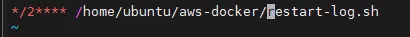
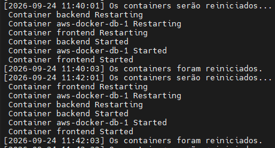
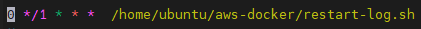

# Script para reiniciar e registrar o log 

O primeiro passo é criar nosso arquivo de script através do  vi, para isso utilizaremos o comando `vi restart-log.sh` ao entrar no vi devemos pressionar o i para que possamos entrar no modo de inserção. 

```bash
#!/bin/bash - Diz ao SO qual insterpretador usar para executar nosso script 
LOG_FILE="/home/ubuntu/aws-docker/restart.log" 
cd /home/ubuntu/aws-docker

echo "[$(date '+%Y-%m-%d %H:%M:%S')] Reiniciando containers..." >> "$LOG_FILE"
docker compose restart >> "$LOG_FILE" 2>&1
echo "[$(date '+%Y-%m-%d %H:%M:%S')] Containers reiniciados." >> "$LOG_FILE"`
```
- `LOG_FILE`: variável com o caminho do arquivo onde o histórico de restarts é registrado.
- `cd /home/ubuntu/aws-docker`: garante que o `docker compose` seja executado a partir do diretório correto, independente de onde o agendador dispare o script.
- `date '+%Y-%m-%d %H:%M:%S'`: gera um timestamp legível (ano-mês-dia hora:minuto:segundo), usado para marcar início e fim de cada restart.
- `>> "$LOG_FILE"`: redireciona a saída **acrescentando** ao final do arquivo (não sobrescrevendo), preservando o histórico de execuções anteriores.
- `2>&1`: redireciona também as mensagens de erro (stderr) para o mesmo log, não só a saída normal (stdout) — garante que falhas do `docker compose restart` fiquem registradas.
- `chmod +x`: concede permissão de execução ao script.


Posteriormente devemos fazer o agendamento com utilizando o comando abaixo, inicialmente testei o agendamento de 2 em 2 minutos e depois alteirei para o restart ser feito de 1 em 1 hora.

```bash
crontab -e
```

### Como Funciona o Agendamento (Crontab)

O agendamento do Linux utiliza 5 campos de tempo seguidos pelo comando. A estrutura funciona da seguinte forma:

```text
 * * * * * comando-a-executar
│ │ │ │ │
│ │ │ │ └── dia da semana (0-6, domingo=0)
│ │ │ └──── mês (1-12)
│ │ └────── dia do mês (1-31)
│ └──────── hora (0-23)
└────────── minuto (0-59)
```

#### Símbolos Especiais:
* `*` : Executa em **todos** os valores daquele campo.
* `*/n` : Executa em intervalos de **X em X** tempos (Ex: `*/15` no minuto = a cada 15 minutos).
* `-` : Define um **intervalo** de valores (Ex: `1-5` no dia da semana = de Segunda a Sexta).
* `,` : Define uma **lista** de valores específicos (Ex: `0,30` no minuto = apenas no minuto 0 e no minuto 30).

Então para editar o tempo desejado devemos entrar no editor do crontab

```bash
   sudo crontab -e
```



Dessa primeira forma definimos para ele para realilzar o restart de 2 em dois minutos o que nos deu esse retorno 



Após isso foi realizado a alteração para que ele fosse reiniciado de 1 em uma hora. E para termos os controles e sabermos do log podemos utilizar o comando abaixo:



```bash
cat restart.log
```
