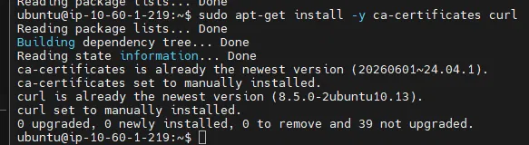
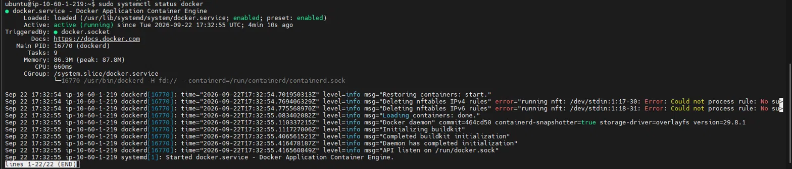
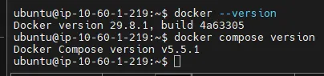
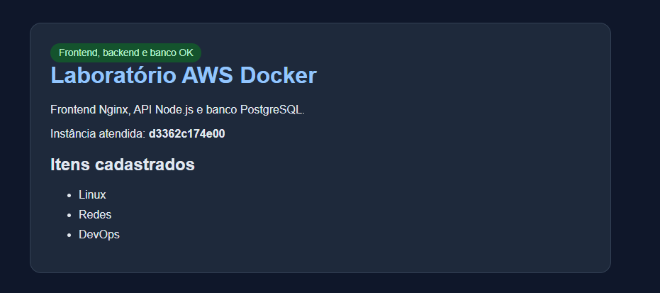
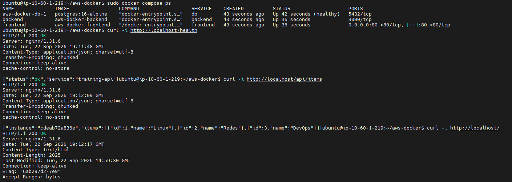
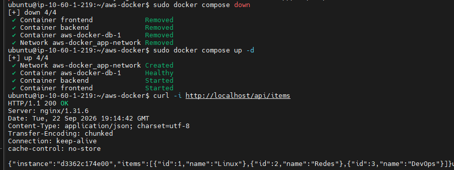

# Laboratório AWS Docker — Roteiro do Trainee

Aplicação em três camadas conteinerizada com Docker e Docker Compose, em uma instância Ubuntu na AWS:

```
navegador -> frontend Nginx -> backend Node.js -> PostgreSQL
```

---

## Etapa 01 - Instale Docker Engine e Docker Compose

```bash
lsb_release -a
```

Nos mostra as informações padronizadas da distribuição Linux, foi utilizada para sabermos a versão do ubuntu da VM. Que neste caso era: **Ubuntu 24.04 LTS (noble)**.

### Passo 1: atualizar a lista de pacotes e instalar dependências

```bash
sudo apt-get update
sudo apt-get install -y ca-certificates curl
```

- `apt-get update` sincroniza a lista local de pacotes com os repositórios remotos, sem instalar nada.
- `ca-certificates` permite ao sistema confiar em conexões HTTPS, e `curl` é usado para baixar a chave GPG do Docker.



### Passo 2: adicionar a chave GPG oficial do Docker

```bash
sudo install -m 0755 -d /etc/apt/keyrings
sudo curl -fsSL https://download.docker.com/linux/ubuntu/gpg -o /etc/apt/keyrings/docker.asc
sudo chmod a+r /etc/apt/keyrings/docker.asc
```

Os pacotes do Docker são assinados digitalmente. Esses comandos criam o diretório padrão de chaves de repositórios de terceiros, baixam a chave pública do Docker e garantem que o `apt` consiga lê-la — é isso que permite ao `apt` verificar a autenticidade dos pacotes antes de instalar.

### Passo 3: adicionar o repositório do Docker à lista de fontes do apt

```bash
echo \
  "deb [arch=$(dpkg --print-architecture) signed-by=/etc/apt/keyrings/docker.asc] https://download.docker.com/linux/ubuntu \
  $(. /etc/os-release && echo "$VERSION_CODENAME") stable" | \
  sudo tee /etc/apt/sources.list.d/docker.list > /dev/null
```

Registra o repositório oficial do Docker nas fontes do `apt`, já vinculado à chave GPG do passo anterior e à arquitetura/codinome corretos da instância (`amd64`, `noble`).

### Passo 4: atualizar novamente e instalar o Docker

```bash
sudo apt-get update
sudo apt-get install -y docker-ce docker-ce-cli containerd.io docker-buildx-plugin docker-compose-plugin
```

- `docker-ce`: o motor (daemon) do Docker.
- `docker-ce-cli`: a interface de linha de comando usada para falar com o daemon.
- `containerd.io`: runtime de baixo nível que gerencia o ciclo de vida dos containers.
- `docker-buildx-plugin`: estende o `docker build` com recursos modernos.
- `docker-compose-plugin`: adiciona o subcomando `docker compose`, usado para orquestrar múltiplos containers a partir do `compose.yml`.

---

## Etapa 02 - Habilite e inicie o serviço do Docker

```bash
sudo systemctl status docker
```

- **`Active: active (running)`** → o daemon está rodando e processando containers.
- **`Loaded: ... enabled; preset: enabled`** → habilitado para iniciar automaticamente no próximo boot da instância.



Nesta instância, o pacote `docker-ce` já habilitou e iniciou o serviço automaticamente durante a instalação. Caso não viesse ativo, o comando para habilitar e iniciar manualmente seria:

```bash
sudo systemctl enable --now docker
```

Confirmação das versões instaladas:

```bash
docker --version
docker compose version
```

`docker --version` confirma a engine principal; `docker compose version` confirma especificamente o plugin do Compose — são pacotes diferentes (`docker-ce` e `docker-compose-plugin`), por isso vale checar os dois isoladamente.



---

## Etapa 03 - Examine backend/package.json e backend/server.js

```bash
cat backend/package.json
```

É o arquivo de configuração do projeto Node.js. Dele extraímos três informações essenciais para o Dockerfile:
- `"main": "server.js"` e `"scripts": { "start": "node server.js" }` → como a aplicação é iniciada.
- `"dependencies": { "pg": "^8.13.1" }` → única dependência externa, o driver de conexão com PostgreSQL. Confirma a necessidade de rodar `npm install` na imagem.
- Ausência de framework (como Express) indica que o servidor HTTP é implementado com o módulo nativo do Node.

```bash
cat backend/server.js
```

Pontos-chave do código:
- Usa o módulo nativo `http` (sem framework externo) para criar o servidor.
- Lê toda a configuração via variáveis de ambiente (`process.env.DB_HOST`, `DB_PORT`, `DB_NAME`, `DB_USER`, `DB_PASSWORD`, `PORT`), com valores padrão sensatos — inclusive `DB_HOST` já assumindo `db` por padrão, o nome de serviço que o Compose vai usar.
- Expõe duas rotas: `GET /health` (checagem simples, sem tocar no banco) e `GET /api/items` (consulta `SELECT id, name FROM items` no PostgreSQL).
- O servidor escuta em `0.0.0.0` (não em `localhost`), o que é essencial em containers: `localhost` só aceitaria conexões vindas de dentro do próprio container, enquanto `0.0.0.0` aceita conexões de qualquer origem alcançável, incluindo outros containers como o do frontend.
- Trata os sinais `SIGTERM`/`SIGINT` para encerrar o servidor e a conexão com o banco de forma limpa.

---

## Etapa 04 - Crie um Dockerfile para o backend

```bash
vi backend/Dockerfile
```

```dockerfile
FROM node:20-alpine
WORKDIR /app
COPY package.json ./
RUN npm install --production
COPY . .
EXPOSE 3000
CMD ["node", "server.js"]
```

- `FROM node:20-alpine`: imagem base já com Node.js 20, sobre Alpine (distro Linux minimalista, imagem final mais leve).
- `WORKDIR /app`: define o diretório de trabalho dentro do container.
- `COPY package.json ./` + `RUN npm install --production`: copia o manifesto e instala as dependências **antes** de copiar o restante do código. Isso aproveita o cache de camadas do Docker — o `npm install` só roda de novo se o `package.json` mudar, não a cada alteração no código-fonte.
- `COPY . .`: copia o restante do código (`server.js`).
- `EXPOSE 3000`: documenta a porta usada pela aplicação (não publica nada por si só).
- `CMD ["node", "server.js"]`: comando executado ao iniciar o container, na forma "exec" (sem passar por shell intermediário), garantindo que o Node receba corretamente os sinais de encerramento.

---

## Etapa 05 - Crie um Dockerfile para o frontend usando o frontend/nginx.conf

Verificação feita antes de escrever o Dockerfile:

```bash
cat frontend/index.html
echo "---"
cat frontend/nginx.conf
```

- `index.html`: página estática que, via JavaScript, faz `fetch('/api/items')` ao carregar, preenchendo dinamicamente o nome da instância e a lista de itens vindos do banco.
- `nginx.conf`: configura o Nginx para servir os arquivos estáticos a partir de `/usr/share/nginx/html` (caminho padrão da imagem oficial) e encaminha as rotas `/api/` e `/health` para `http://backend:3000` — usando o nome do serviço `backend`, não `localhost`, para que a comunicação funcione entre containers na rede do Compose.

```bash
vi frontend/Dockerfile
```

```dockerfile
FROM nginx:alpine
COPY index.html /usr/share/nginx/html/index.html
COPY nginx.conf /etc/nginx/conf.d/default.conf
EXPOSE 80
```

- `FROM nginx:alpine`: imagem oficial do Nginx, leve, já com o servidor pronto.
- `COPY index.html ...`: coloca o HTML no caminho que o `root` do `nginx.conf` espera.
- `COPY nginx.conf ...`: substitui a configuração padrão da imagem pela configuração customizada, com os blocos de proxy para o backend.
- `EXPOSE 80`: documenta a porta usada.
- Não é necessário `CMD`: a imagem `nginx:alpine` já define o comando de inicialização do servidor, que é herdado automaticamente.

---

## Etapa 06 - Complete o compose.yml com os serviços backend e frontend

O `compose.yml` inicial só continha o serviço `db`. Foram adicionados os serviços `backend` e `frontend`, além da rede customizada usada por todos os três, o arquivo do compose esta em anexo para ser visto.


- `db` e `backend` usam a diretiva `build:` (constroem imagem a partir dos Dockerfiles criados nas Etapas 4 e 5), enquanto `db` usa `image:` (imagem pronta, baixada do Docker Hub).
- Todos os três serviços compartilham a rede `app-network`, declarada no nível raiz do arquivo — é o que permite que se enxerguem entre si pelo nome do serviço (`db`, `backend`).
- Apenas o `frontend` publica porta para fora (`ports: - "80:80"`), atendendo ao requisito de que só a porta HTTP do frontend precisa ficar acessível pela internet.

A validação de sintaxe foi feita com:

```bash
docker compose config
```

Esse comando não sobe containers — ele só valida o YAML e mostra a configuração final normalizada, apontando erros de sintaxe antes de tentar subir a aplicação.

---

## Etapa 07 - Configure as variáveis de ambiente e a dependência saudável do banco

Ambas as configurações fazem parte do bloco `backend` do `compose.yml` (Etapa 06):

**Variáveis de ambiente** (`environment:`), lidas pelo `server.js` via `process.env` para montar a conexão com o banco e definir a porta de escuta:

```yaml
    environment:
      DB_HOST: db
      DB_PORT: 5432
      DB_NAME: training
      DB_USER: training_app
      DB_PASSWORD: training_password
      PORT: 3000
```

**Dependência saudável do banco** (`depends_on:` com `condition: service_healthy`):

```yaml
    depends_on:
      db:
        condition: service_healthy
```

Diferente de um `depends_on` simples (que só espera o container **iniciar**), essa condição faz o `backend` esperar o **healthcheck** do `db` (`pg_isready`) reportar que o banco está de fato aceitando conexões, antes de sequer tentar iniciar. Isso evita que o backend tente se conectar a um banco ainda não pronto.

---

## Etapa 08 - Suba os serviços e valide a aplicação pelo navegador e pelos endpoints de saúde

### Subindo os containers

```bash
docker compose up -d --build
```

- `-d`: roda os containers em segundo plano.
- `--build`: força a construção das imagens do backend e frontend a partir dos Dockerfiles antes de subir.

Obs.: foi necessário adicionar o usuário `ubuntu` ao grupo `docker` (`sudo usermod -aG docker $USER` + `newgrp docker`) para rodar comandos Docker sem `sudo`.

### Conferindo o status dos containers

```bash
docker compose ps
```

Os três serviços apareceram como `Up`, com o `db` marcado como `(healthy)`. Apenas o `frontend` mostra porta publicada (`0.0.0.0:80->80/tcp`); `backend` e `db` permanecem acessíveis apenas na rede interna.

### Validando os endpoints

```bash
curl -i http://localhost/health
curl -i http://localhost/api/items
curl -i http://localhost/
```

Todos retornaram `HTTP/1.1 200 OK`. O `/api/items` retornou os itens cadastrados pelo `database/init.sql`:

```json
{"instance":"cdeab72a836e","items":[{"id":1,"name":"Linux"},{"id":2,"name":"Redes"},{"id":3,"name":"DevOps"}]}
```

Isso comprova a cadeia completa funcionando: navegador → Nginx (frontend) → proxy `/api/` → backend (Node.js) → consulta ao PostgreSQL pelo nome de serviço `db`.

### Validação visual pelo navegador

Acesso via `http://<IP-público-da-instância>/`:

- Aplicação pelo navegador



- Endpoints de saúde




### Teste de persistência dos dados

```bash
docker compose down
docker compose up -d
curl -i http://localhost/api/items
```

`docker compose down` remove os containers, mas **não remove volumes nomeados** por padrão — o volume `postgres_data` permaneceu intacto. Após recriar os containers, o `curl` continuou retornando os mesmos três itens (`Linux`, `Redes`, `DevOps`), confirmando que os dados persistem independentemente do ciclo de vida dos containers.

### Confirmando que a porta do banco não está exposta

```bash
sudo ss -tlnp | grep 5432
```

A porta 5432 não aparece escutando em `0.0.0.0`, apenas na rede interna do Compose — o serviço `db` nunca teve uma seção `ports:` no `compose.yml`, garantindo que o PostgreSQL não fica acessível pela internet.

---

## Critérios de conclusão — checklist final

- [x] `GET /` abre a interface web
- [x] A interface mostra Linux, Redes e DevOps
- [x] `GET /health` responde HTTP 200
- [x] O backend acessa o PostgreSQL pelo nome `db`, sem usar `localhost`
- [x] Os dados continuam disponíveis após recriar os containers, usando o volume do banco
- [x] Porta 5432 não exposta à internet